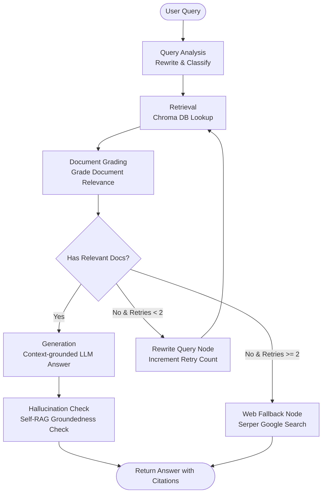

a# RAG-Based Technical Documentation Assistant

A state-of-the-art **Retrieval-Augmented Generation (RAG)** system equipped with a **self-corrective LangGraph workflow**, custom document ingestion, query classification, real-time citation tracking, short-term session memory, and web search fallbacks. Built for the **Express Analytics AI/ML Engineer Intern Take-Home Assignment**.

---

##  Key Features & Architectural Highlights

1. **Self-Corrective LangGraph Workflow**: Implemented as a stateful cyclic graph with multiple intelligent nodes that dynamically grade retrieved documents and, if needed, cycle back to rewrite queries with alternate keyword variants up to a strict retry limit.
2. **Multi-Source Ingestion Pipeline**: Ingests files (Markdown, Text) and public HTML web pages (URLs). Content is parsed and stripped of boilerplate tags using `BeautifulSoup` and loaded dynamically.
3. **Structured Query Analysis**: Employs LLM-powered structured output to analyze technical questions, rewrite queries for improved similarity matching, and classify user intent (conceptual, how-to, troubleshooting, API reference).
4. **Offline Similarity Search**: Uses a local `ChromaDB` instance paired with `SentenceTransformer`'s `all-MiniLM-L6-v2` embeddings for super-fast offline query vectorization and lookups.
5. **Robust Security & Leaked Key Guard**: Programmed with a proactive check to verify the health and status of API keys upon startup, providing helpful, actionable instructions in the event of credential leaks.
6. **Dual interface**:
   - **FastAPI REST Service**: Validated schemas (Pydantic v2), uploading files or scraping URLs, and recording user feedback in a structured database file.
   - **Vibrant Gradio UI**: Premium visual design with linear gradients, custom slate styling, interactive query submission, intent visualization, and clickable markdown link citations.

---

##  System Architecture & Workflow

Here is how data flows through the LangGraph State Machine:



---

##  Tech Stack

* **Language**: Python 3.10+
* **Orchestration**: `LangGraph`, `LangChain`
* **API Framework**: `FastAPI` + `Uvicorn`
* **Interactive UI**: `Gradio` (Premium Slate & Indigo Theme)
* **LLM Model**: Google `Gemini 1.5 Flash` (via `langchain-google-genai`)
* **Vector Store & Embeddings**: `ChromaDB` + `SentenceTransformer` (`all-MiniLM-L6-v2`)
* **Web Scraper & Search**: `BeautifulSoup4`, `Requests`, `Serper API`

---

##  Setup & Installation

### 1. Clone & Navigate
Ensure you are in the project root directory:
```bash
cd Rag_assistant
```

### 2. Configure Environment Variables
Create a file named `.env` in the root directory (or update the existing one) with your API keys:
```env
GEMINI_API_KEY=your_google_gemini_api_key_here
SERPER_API_KEY=your_serper_search_api_key_here
```
> [!IMPORTANT]
> If Google AI Studio reports your API key as leaked/revoked, the startup script will automatically alert you and print instructions on how to regenerate a fresh API key.

### 3. Setup Virtual Environment & Install Dependencies
Activate the virtual environment and install packages:
```bash
# For Windows PowerShell
.\venv\Scripts\Activate.ps1
pip install -r requirements.txt
```

---

##  Running the Application

We have created a convenient runner script `dev.py` in the root directory to handle common development workflows.

### A. Ingest Default Documents
To pre-populate the database with the included technical docs (covering FastAPI, Pydantic, and LangGraph):
```bash
python dev.py ingest
```

### B. Launch the Gradio Web UI (Recommended)
This starts the premium interactive frontend web interface:
```bash
python dev.py ui
```
Open **`http://localhost:7860`** in your browser.

-Conceptual Queries
```
What is LangGraph used for
```
```
Why do developers use Pydantic
```
- How‑to Queries
```
Show me a Pydantic model with validation
```
```
How do I run a FastAPI app with Uvicorn
```
- Troubleshooting Queries
```
Why does FastAPI return 422 for invalid path parameters
```
```
What happens if a Pydantic field fails validation
```
- API Reference Queries
```
Explain the Field function in Pydantic
```
```
What are query parameters in FastAPI
```
- Fallback / Web Search

```
What is the latest version of LangGraph
```
```
Who maintains Pydantic
```
### C. Launch the FastAPI Backend Server
This runs the production-ready REST API backend with automatic Swagger UI documentation:
```bash
python dev.py api
```
Open **`http://localhost:8000/docs`** to explore endpoints interactively!

---

##  Example API Requests & Responses

Below are standard API integration snippets for interacting with the FastAPI server:

### 1. Ingest from a Public URL
* **Endpoint**: `POST /ingest`
* **Curl Command**:
```bash
curl -X POST "http://localhost:8000/ingest" \
     -F "url=https://fastapi.tiangolo.com/tutorial/path-params/"
```
* **Response**:
```json
{
  "status": "success",
  "source": "https://fastapi.tiangolo.com/tutorial/path-params/",
  "chunks_ingested": 8
}
```

### 2. Ingest via File Upload
* **Endpoint**: `POST /ingest`
* **Curl Command**:
```bash
curl -X POST "http://localhost:8000/ingest" \
     -F "file=@docs/fastapi.md"
```

### 3. List Ingested Corpus Files
* **Endpoint**: `GET /documents`
* **Response**:
```json
{
  "documents": [
    "fastapi.md",
    "langgraph.md",
    "pydantic.md"
  ]
}
```

### 4. Query the self-corrective Assistant
* **Endpoint**: `POST /query`
* **Payload**:
```json
{
  "question": "How do path parameters work in FastAPI?"
}
```
* **Response**:
```json
{
  "answer": "Path parameters are declared using curly braces `{item_id}` as shown in [docs/fastapi.md]. FastAPI automatically validates that the parameter matches the declared Python type (e.g. `int`), returning an HTTP error if they mismatch.",
  "query_type": "HOW-TO",
  "sources": [
    {
      "source": "docs/fastapi.md",
      "title": "FastAPI Guide"
    }
  ]
}
```

### 5. Submit User Feedback
* **Endpoint**: `POST /feedback`
* **Payload**:
```json
{
  "answer_id": "session_query_045",
  "thumbs_up": true,
  "comment": "Perfect answer with accurate path parameter citations!"
}
```
* **Response**:
```json
{
  "status": "recorded",
  "feedback": {
    "answer_id": "session_query_045",
    "thumbs_up": true,
    "comment": "Perfect answer with accurate path parameter citations!"
  }
}
```

---

##  Design Decisions, Tradeoffs, and In-depth Write-up

### 1. Cyclic Self-Corrective Graph Workflow
Unlike simple linear pipelines (Retrieve -> Generate), this project employs **LangGraph's cyclic StateGraph** containing conditional routing.
* **Why**: Similarity searches are highly sensitive to phrasing. If standard search retrieves zero relevant chunks, a linear RAG assistant fails immediately. By introducing the `rewrite_query` cycle, the LLM actively analyzes its previous failure and adjusts terms (e.g., swapping abstract concepts for code keywords), attempting to search up to 2 times before gracefully resorting to search engines.
* **Tradeoff**: Query rewriting adds latency on initial misses. However, this is heavily outweighed by the significant increase in query retrieval recall and precision.

### 2. Chunking & Ingestion Strategy
* **Configuration**: Recursive text splitting with `chunk_size=800` and `chunk_overlap=100`.
* **Reasoning**: Technical documentation contains code snippets, classes, and nested tables. A small chunk size (< 400) breaks code syntax, rendering code blocks useless inside prompts. Conversely, a large chunk size (> 1200) risks injecting noisy irrelevant descriptions that confuse the model. The 800-chunk parameter with 100-character overlap successfully keeps whole functions, structural signatures, and adjacent commentary intact.

### 3. Local + Web Hybrid Architecture (Offline Embeddings)
We use a local `Chroma` database and local HuggingFace embeddings (`all-MiniLM-L6-v2`) in conjunction with cloud-based LLM generation.
* **Reasoning**: Offline embeddings and vector storage ensure zero local lookup latency and cost. It guarantees that parsing, storing, and fetching vectors remains free, local, and lightweight. We combine this with Google's fast, low-cost `Gemini 1.5 Flash` API to generate replies in seconds.
* **Fallback Strategy**: If local documentation is completely absent, the pipeline automatically calls `Serper API` to scrape Google search snippets, wrapping web results as standard context documents to provide structured cites for the user.

---

##  What We Would Improve With More Time

1. **Hybrid Ingestion Formats**: Add support for parsing PDF structures, structured JSON specs, and automatic API reference crawl maps.
2. **Persistent DB Feedback**: Replace the local `feedback.json` file with a lightweight relational PostgreSQL or SQLite database, enabling complex query filtering, review interfaces, and analytics.
3. **Advanced User Authentication**: Implement JWT tokens and multi-tenant isolation so that separate developers can keep personal custom indexes and conversations separate.
4. **Vector Re-Ranking**: Integrate a Cross-Encoder Re-ranker (like Cohere or BGE) after retrieval to order chunks based on semantic matching rather than raw vector cosine similarity alone.
